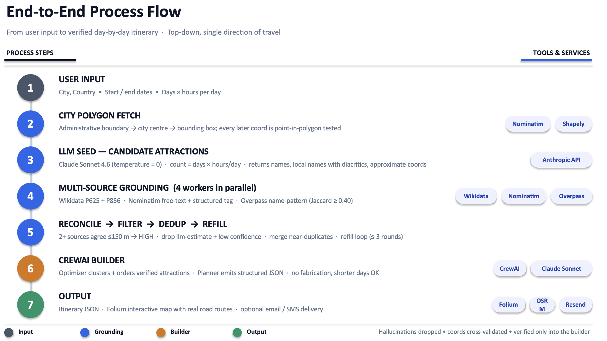
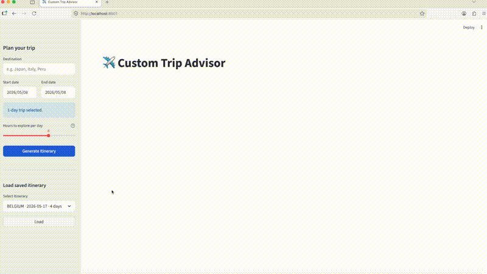

# ✈️ Custom Trip Advisor

> **Note — Model change**
> In this project **Claude Haiku 4.5 (`claude-haiku-4-5-20251001`)** was replaced by **Claude Sonnet 4.6 (`claude-sonnet-4-6`)** to minimize hallucination — Haiku produced too many fabricated attractions and missed landmarks Sonnet correctly identified.
> Please note that the cost of Sonnet is about **3× higher** than Haiku per MToken (million tokens) — both for input and output.

A multi-AI-agent travel planner built with **CrewAI** and **Claude Sonnet**. Enter a destination as `City, Country` and travel dates, and the pipeline produces a structured day-by-day itinerary with real road routing, an interactive map, and optional email delivery.

The itinerary is built in two stages:

1. **Attractions Finder** — an LLM proposes candidate attractions, then each candidate is **grounded against Wikidata, OpenStreetMap, and Overpass** to confirm it exists and to attach precise GPS coordinates. Unverifiable suggestions are dropped as hallucinations.
2. **Route Optimizer → Planner** — the verified attractions are clustered by proximity, ordered into days, and rendered as a final itinerary JSON.

The project ships in **two versions** that share the same AI pipeline:

| Version | Tech stack | Best for |
|---|---|---|
| **Streamlit** | Streamlit | Quick local use, data-science style UI |
| **FastAPI** | FastAPI + HTMX + Jinja2 | Production-style web UI + REST API |

---

## Process flow

End-to-end pipeline from `City, Country` input through grounded attractions to the final itinerary:



---

## Demo — Streamlit



---

## Demo — FastAPI + HTMX + Jinja2 — WIP

---

## Features

- **Grounded attractions** — every attraction is cross-validated against Wikidata (P625) and OpenStreetMap before being used; LLM hallucinations are dropped automatically
- **Precise GPS coordinates** — coordinates come from curated Wikidata data where available, with Nominatim and Overpass as cross-checks
- **Day-by-day itinerary** generated by a two-stage pipeline (Attractions Finder → Optimizer + Planner)
- **City-polygon boundary check** — every coordinate is point-in-polygon tested against the city's administrative boundary fetched from Nominatim
- **Interactive map** with real road routes (OpenStreetMap + OSRM — no API key required)
- **Configurable explore-time budget** — hours per day × number of days drives how many attractions to find
- **Save & reload** itineraries as JSON
- **Send by email** (Resend API)
- **Speech-to-text** for destination input — FastAPI REST API only (Faster Whisper, runs locally) — **WIP**

---

## Project structure

```
.
├── core/                            # Shared AI pipeline — used by BOTH versions
│   ├── attractions_finder.py        # Wikidata + Nominatim + Overpass grounding (parallel)
│   ├── agents.py                    # CrewAI agent definitions
│   ├── tasks.py                     # CrewAI task definitions (incl. attractions-aware variant)
│   ├── crew_runner.py               # run_crew_with_attractions() — optimizer + planner chain
│   ├── models.py                    # Pydantic models (Itinerary, FoundAttraction, AttractionsResult, …)
│   ├── config.py                    # Loads .env, exposes MODEL constant
│   ├── guard.py                     # Destination validation via Claude (legacy — not on the main path)
│   ├── transcriber.py               # Speech-to-text via Faster Whisper
│   ├── routing.py                   # OSRM road-routing calls
│   ├── map_builder.py               # Folium interactive map builder
│   ├── email_sender.py              # Resend email integration
│   ├── display.py                   # Shared formatting helpers
│   └── sms_sender.py                # Twilio SMS (in development)
│
├── streamlit_app/                   # ── STREAMLIT VERSION ──────────────────
│   └── app.py                       # Single-file Streamlit UI
│
├── fastapi_app/                     # ── FASTAPI VERSION — REST API ─────────
│   ├── main.py                      # API endpoints (/validate, /generate, …)
│   └── schemas.py                   # Pydantic request/response schemas
│
├── web_app/                         # ── FASTAPI VERSION — Web UI ───────────
│   ├── main.py                      # FastAPI + Jinja2 routes
│   ├── static/
│   │   ├── style.css                # UI stylesheet
│   │   └── map.html                 # Generated map (written at runtime)
│   └── templates/
│       ├── base.html                # HTML shell (HTMX, Flatpickr, CSS)
│       ├── index.html               # Main page with form + saved-itinerary loader
│       └── partials/
│           ├── itinerary.html       # Itinerary result (HTMX partial)
│           └── email_result.html    # Email send result (HTMX partial)
│
├── itinerary/                       # Saved itineraries as JSON (git-ignored)
├── assets/                          # Demo GIF and screenshots
├── .streamlit/
│   └── config.toml                  # Enables static file serving for the Streamlit map
├── requirements.txt
└── .env                             # Your credentials — never committed
```

### Which files belong to which version

| File / folder | Streamlit | FastAPI |
|---|:---:|:---:|
| `core/` | ✅ | ✅ |
| `streamlit_app/` | ✅ | — |
| `.streamlit/` | ✅ | — |
| `fastapi_app/` | — | ✅ |
| `web_app/` | — | ✅ |

---

## Requirements

### Python

Python **3.10 or later** is required.

### API keys and credentials

Create a `.env` file in the project root:

```
# AI (required by both versions)
ANTHROPIC_API_KEY=your_anthropic_api_key
LLM_MODEL=anthropic/claude-sonnet-4-6

# CrewAI tracing (recommended — suppresses noisy warnings)
CREWAI_TRACING_ENABLED=true
OTEL_SDK_DISABLED=true

# Email — Resend (required for Send Email feature)
RESEND_API_KEY=your_resend_api_key
EMAIL_SENDER=onboarding@resend.dev

# SMS — Twilio (WIP)
TWILIO_ACCOUNT_SID=your_twilio_account_sid
TWILIO_AUTH_TOKEN=your_twilio_auth_token
TWILIO_FROM_NUMBER=your_twilio_phone_number
```

Where to get the keys:
- **Anthropic API key** — [console.anthropic.com](https://console.anthropic.com)
- **Resend API key** — [resend.com](https://resend.com) (free tier available)
- **Twilio credentials** — [twilio.com/console](https://www.twilio.com/console)

> `.env` is listed in `.gitignore` and will never be committed.

---

## Setup

**1. Clone the repository**
```bash
git clone https://github.com/your-username/custom-trip-advisor.git
cd custom-trip-advisor
```

**2. Create and activate a virtual environment**
```bash
python3 -m venv trip-env
source trip-env/bin/activate        # macOS / Linux
trip-env\Scripts\activate           # Windows
```

**3. Install dependencies**
```bash
pip install -r requirements.txt
```

> This may take a few minutes — CrewAI pulls in a number of packages.

**4. Create your `.env` file** — see the [credentials section](#api-keys-and-credentials) above.

---

## Running the app

### Streamlit version

With virtual environment activated:
```bash
source trip-env/bin/activate && streamlit run streamlit_app/app.py
```

Or without activating:
```bash
./trip-env/bin/streamlit run streamlit_app/app.py
```

Opens automatically at `http://localhost:8501`.

---

### FastAPI version

The FastAPI version has two separate servers that run independently — the **REST API** and the **Web UI**. You can run either one or both.

#### REST API (with interactive docs)

With virtual environment activated:
```bash
source trip-env/bin/activate && uvicorn fastapi_app.main:app --reload --port 8000
```

Or without activating:
```bash
./trip-env/bin/uvicorn fastapi_app.main:app --reload --port 8000
```

- Interactive Swagger docs: `http://localhost:8000/docs`
- ReDoc docs: `http://localhost:8000/redoc`

This is the best way to explore and test each endpoint individually.

#### Web UI

With virtual environment activated:
```bash
source trip-env/bin/activate && uvicorn web_app.main:app --reload --port 8001
```

Or without activating:
```bash
./trip-env/bin/uvicorn web_app.main:app --reload --port 8001
```

Opens at `http://localhost:8001`.

> The REST API and the Web UI are **independent** — the web UI does not call the REST API internally; both use `core/` directly. You do not need to run the REST API to use the Web UI.

---

## FastAPI REST API endpoints

| Method | Route | Description |
|---|---|---|
| `POST` | `/validate` | Validate a destination name (legacy guard model) |
| `POST` | `/generate` | Full pipeline: grounded attractions → optimized day-by-day itinerary |
| `POST` | `/attractions/find` | Grounded attractions only (no itinerary) — returns `AttractionsResult` |
| `GET` | `/itineraries` | List all saved itineraries |
| `GET` | `/itineraries/{filename}` | Load a specific itinerary |
| `POST` | `/itineraries/{filename}/email` | Email a saved itinerary |
| `POST` | `/transcribe` | Transcribe an audio file to text (STT) |

---

## Usage (both versions)

1. Enter a **destination** as `City, Country` (e.g. `Koszalin, Poland`), then **start date** and **end date**.
2. Set how many **days** and **hours per day** you want to explore (driving time is excluded from the hour budget). The number of attractions to find is computed automatically as `days × hours_per_day` (roughly one attraction per hour).
3. Click **Generate Itinerary**. The Attractions Finder runs first (~3–5 min for a small city), then the Optimizer + Planner build the itinerary (~30–60 s).
4. Use the action buttons to **open the map**, **send the itinerary by email**, or **load a previously saved itinerary**.

---

## Language model

All AI tasks use **Claude Sonnet** (`claude-sonnet-4-6`) via the Anthropic API. The Attractions Finder uses the raw Anthropic SDK directly; CrewAI's optimizer and planner agents use the LiteLLM integration with the model ID `anthropic/claude-sonnet-4-6`.

Sonnet is used in three places:

| Purpose | Where | Notes |
|---|---|---|
| **Candidate attractions seed list** | `core/attractions_finder.py` — `_ask_llm()` | `temperature=0` for deterministic factual recall. Returns name, local_name (with diacritics), category, short description, candidate website, and approximate coordinates. Coordinates are **never trusted** — they are immediately cross-validated against external sources. |
| **Route optimisation** | `core/agents.py` — Optimizer agent | Clusters the verified attractions geographically, orders them across the requested days with zero backtracking. |
| **Itinerary planning** | `core/agents.py` — Planner agent | Renders the optimizer's output as the final structured `Itinerary` JSON. |

The model ID is configured in `.env` via `LLM_MODEL=anthropic/claude-sonnet-4-6` and loaded in `core/config.py`. The `anthropic/` prefix is required for CrewAI/LiteLLM; the Attractions Finder strips it before calling the raw Anthropic SDK.

---

## Attractions search & coordinate grounding

The Attractions Finder (`core/attractions_finder.py`) is the heart of the new pipeline. It takes a `city`, `country`, and `count` and returns a list of verified attractions, each with precise GPS coordinates and a confidence label. **It runs before the CrewAI Optimizer + Planner** and replaces what was previously an unreliable single-LLM Researcher step.

### The pipeline — 6 phases per generation

#### Phase 0 — City boundary

Query [Nominatim](https://nominatim.openstreetmap.org/) for the city's administrative polygon (`polygon_geojson=1`). The first `Polygon` or `MultiPolygon` hit is loaded into a [`shapely`](https://shapely.readthedocs.io/) geometry and used as the **single source of truth** for *"is this coordinate inside the city?"*. Every candidate coordinate later in the pipeline is point-in-polygon tested against this shape. If no polygon is found, the pipeline falls back to a 10 km radius from the polygon centroid.

#### Phase 1 — LLM seed list (Claude Sonnet)

Sonnet is asked for `count + buffer` attractions in strict JSON, returning per item: official English name, **exact local name with diacritics** (this is the primary search key for OSM lookups), category, short description, candidate website, and approximate coordinates.

Key constraint in the prompt: *"When a landmark building stands on or in a public square (e.g. a town hall on a market square), include the BUILDING only, not the square"* — this prevents Town Hall + Market Square showing up as two separate attractions when they are 50 m apart.

#### Phase 2 — Wikidata SPARQL

For each attraction, multiple search variants are tried against the [Wikidata search API](https://www.wikidata.org/w/api.php) (`local_name + city` → `short_name + city` → `short_name`). For the first hit, a SPARQL query against [query.wikidata.org](https://query.wikidata.org/) fetches:

- **P856** — official website
- **P625** — curated GPS coordinates

Wikidata's P625 is **the highest-quality coordinate source** in the pipeline: a hand-curated point, not a polygon centroid. If the returned coordinate is outside the city polygon, the entire Wikidata entity is rejected (the search hit was the wrong entity); its website is discarded with it.

#### Phase 3 — Nominatim free-text geocoding

Multiple query forms (`local_name, city` → `short_name, city` → `name, city`) are tried against [Nominatim](https://nominatim.openstreetmap.org/) with a `viewbox` bias to the city's bounding box. The first in-polygon hit wins.

#### Phase 4 — Nominatim structured search

If free-text fails, a category-based tagged search is tried (`amenity=museum`, `leisure=park`, `historic=castle`, etc.) filtered by city. Results are scored by word overlap against the local name; the best in-polygon match wins.

#### Phase 5 — Overpass API (direct OSM query)

A regex name pattern (built from the 3 longest meaningful words of the local name, with city-name stop-words excluded) is queried against [Overpass](https://overpass-api.de/) with the category tag filter, restricted to the city bounding box. Every returned OSM element is scored by **Jaccard similarity** between its `name`/`name:en` tag and the attraction's local name — only matches with ≥ 0.40 word overlap are accepted. The highest-scoring in-polygon match wins.

#### Phase 6 — Reconciliation (final coordinate + confidence)

The reconciler picks a final coordinate from the candidates collected above:

| Rule | Confidence | Source label |
|---|---|---|
| Wikidata coord exists AND another source agrees within 150 m | **high** | `wikidata + nominatim agree` (etc.) |
| Wikidata coord exists alone | **medium** | `wikidata only` |
| Two non-Wikidata sources agree within 150 m | **high** | `nominatim + overpass agree` (etc.) |
| Sources disagree → highest-weight single source wins (Overpass name-overlap score boosts its weight) | **medium** | `nominatim` / `overpass` |
| LLM coordinate only, no external verification | **llm-estimate** | `llm-estimate` |
| Nothing verified, no LLM coord either | **low** | `none` |

### How hallucinations are minimised

| Defence | Mechanism |
|---|---|
| **Drop unverified attractions** | Anything that ends up with `llm-estimate` or `low` confidence after Phase 6 is treated as a hallucination and removed from the result. The downstream Optimizer + Planner never see it. |
| **City-polygon containment** | Every candidate coordinate from every source is point-in-polygon tested. Out-of-city matches are rejected, including Wikidata entities that turn out to be in a different country. |
| **Overpass name-overlap filter** | Overpass results below 0.40 Jaccard similarity to the attraction's local name are discarded — prevents "Koszalin Cultural Center" matching `MED CENTER` just because both contain the word "Center". |
| **Local-name preference** | All external searches use the LLM's `local_name` (in the country's language with correct diacritics) rather than the English name — gives much higher hit rates on OSM/Wikidata. |
| **Multi-source cross-validation** | High-confidence labels require **two** independent sources agreeing within 150 m. Disagreements force a medium-confidence label with the more-trusted source picked deterministically. |
| **Refill loop with exclusion list** | If after filtering and dedup the result is short of `count`, the LLM is asked for more attractions with an explicit `DO NOT INCLUDE: <names>` list, up to 3 rounds. Prevents the LLM from re-proposing the same hallucinations. |
| **Strict downstream prompts** | The Optimizer task says *"Use ONLY the attractions from the list above. Do NOT add, invent, or include any place not in this list — even if it is famous, nearby, or commonly visited"*. The Planner task says *"do NOT add, invent, or include any attraction not provided by the Route Optimizer"*. If a day doesn't fill the time budget, the prompts explicitly allow a shorter day rather than fabrication. |
| **Dead-URL cache** | Every candidate website is HEAD-checked; dead URLs are cached per-run so they aren't re-verified during refill rounds. |
| **Near-duplicate dedup** | After grounding, attractions within 150 m of each other are merged (higher-confidence wins). Catches cases like Town Hall + Market Square or Cathedral + adjacent church. |

### Data sources and tools used

| Source | What it provides | URL |
|---|---|---|
| **OpenStreetMap (OSM)** | Open community-mapped geographic database; tagged with names, categories, addresses | [openstreetmap.org](https://www.openstreetmap.org/) |
| **Wikidata** | Curated knowledge graph; **P625** for exact GPS coords, **P856** for official websites | [wikidata.org](https://www.wikidata.org/) |
| **Wikidata Search API** | Entity lookup by name (`wbsearchentities`) | `wikidata.org/w/api.php` |
| **Wikidata SPARQL** | Query specific properties (`P625`, `P856`) on an entity by QID | [query.wikidata.org](https://query.wikidata.org/) |
| **Nominatim** | OSM-backed geocoder — free-text and structured (tag-based) search, reverse geocoding, administrative polygon retrieval | [nominatim.openstreetmap.org](https://nominatim.openstreetmap.org/) |
| **Overpass API** | Direct query interface over OSM — name + tag + bounding-box searches for nodes, ways, and relations | [overpass-api.de](https://overpass-api.de/) |
| **Claude Sonnet 4.6** | Seed list of candidate attractions (names, categories, approximate coords) | [Anthropic](https://www.anthropic.com) |
| **Shapely** | Python library for point-in-polygon containment tests against the city boundary | [shapely.readthedocs.io](https://shapely.readthedocs.io/) |
| **OSRM** | Real road routing for the final itinerary map (separate from the grounding step) | [project-osrm.org](http://project-osrm.org/) |

### Concurrency, throttling, and limits

The enrichment phase runs in parallel using `ThreadPoolExecutor` with **4 workers**. Each worker processes one attraction end-to-end, while global per-API throttles ensure we don't overwhelm any single endpoint:

| API | Throttle | Source |
|---|---|---|
| Nominatim | 1.0 s between requests | OSM ToS requires ≤ 1 req/sec |
| Wikidata | 0.5 s between requests + single 3 s retry on HTTP 429 | best-effort fair use |
| Overpass | 0.8 s between requests; query-level timeout 8 s | best-effort fair use |

Other practical limits:
- **Public-API ceiling** — Wikidata Search and Overpass occasionally return 429 (Too Many Requests) or 504 (Gateway Timeout) under load. We retry once, then skip the failed source. The other sources are usually enough.
- **Count variance for small cities** — for smaller cities (e.g. Koszalin) where the LLM hallucinates more, the final count can be a few short of the request even after refill. Larger cities (Paris, Berlin, Rome) reliably hit the requested count.
- **OSM-data errors are not caught** — if Nominatim AND Overpass *both* agree on a wrong location, the pipeline trusts that agreement. Fixing this would require an authoritative external source (paid Places API).
- **Typical runtime** — 3–5 minutes for `count ≈ 24` (a 3-day × 8-hour trip) on a small city; faster for larger cities.

---

## Technology stack

| Component | Technology |
|---|---|
| AI agents | [CrewAI](https://github.com/crewAIInc/crewAI) |
| Language model | Claude Sonnet 4.6 via [Anthropic API](https://www.anthropic.com) |
| Knowledge graph | [Wikidata](https://www.wikidata.org/) (P625 coords, P856 websites) — SPARQL + Search API |
| Geocoding | [Nominatim](https://nominatim.openstreetmap.org/) (free-text, structured, reverse, admin polygons) |
| OSM queries | [Overpass API](https://overpass-api.de/) (tag-filtered name searches) |
| Geometry | [Shapely](https://shapely.readthedocs.io/) (point-in-polygon containment) |
| Maps & routing | [Folium](https://python-visualization.github.io/folium/) + [OSRM](http://project-osrm.org/) |
| Streamlit UI | [Streamlit](https://streamlit.io) |
| FastAPI REST API | [FastAPI](https://fastapi.tiangolo.com) + [Uvicorn](https://www.uvicorn.org) |
| FastAPI Web UI | FastAPI + [HTMX](https://htmx.org) + [Jinja2](https://jinja.palletsprojects.com) |
| Speech-to-text | [Faster Whisper](https://github.com/SYSTRAN/faster-whisper) (local, no API key) — **WIP** |
| Email | [Resend](https://resend.com) |
| SMS | [Twilio](https://www.twilio.com) — **WIP** |
